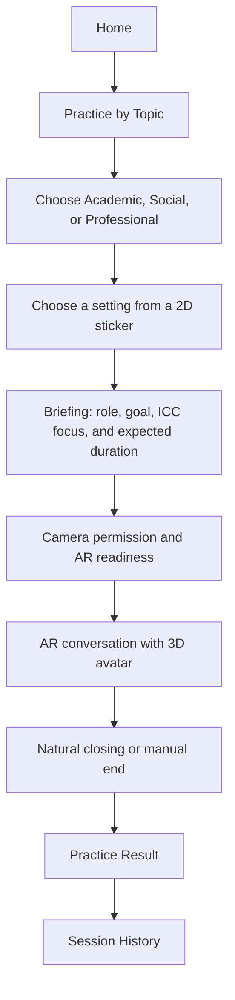
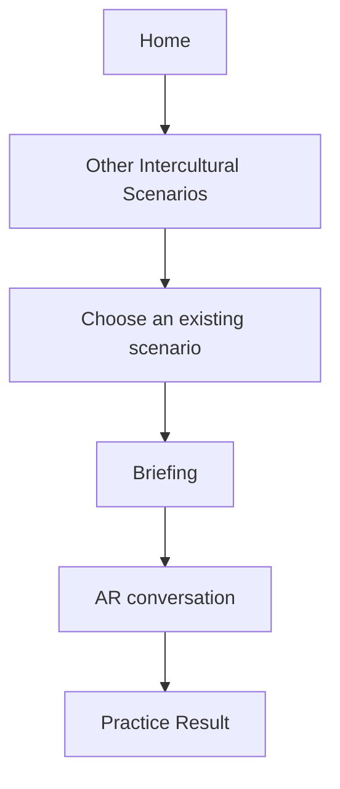
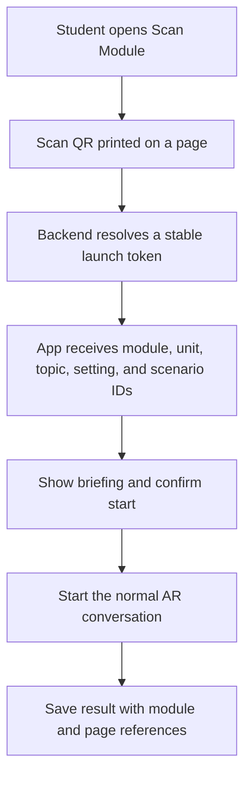

# Implementation Plan: Topics, Settings, and Module QR

**Project:** Intercultural AR and AI Speaking Practice
**Status:** Draft for client and development review
**Scope:** Three new guided topics, preservation of legacy scenarios, and preparation for module/book QR integration

## 1. Purpose

This document defines the next development flow for adding three guided speaking topics without removing the existing intercultural scenarios.

The new experience will let a student:

1. Choose a communication topic.
2. Choose a setting represented by a 2D illustration.
3. Read a short briefing.
4. Start a conversation with a 3D AI avatar over the rear-camera AR view.
5. Receive short silent coaching during the session when needed.
6. Review detailed feedback and scores after the session.

The same conversation can later be launched by scanning a QR code in a printed learning module or book.

## 2. Agreed Product Decisions

- The rear camera remains the visual background during practice.
- Only the speaking character is rendered as a 3D avatar.
- A setting is represented by a 2D sticker or illustration in the selection interface and briefing page.
- The application does not render a separate 3D room or replace the camera with a virtual background.
- Conversations are generated dynamically from context, roles, goals, stages, constraints, and rubric.
- Dialogue scripts are references only and are not hardcoded response paths.
- Existing scenarios remain available and keep their current IDs.
- The AI must remain in the selected role and location for the whole session.
- The AI can address the student using the authenticated user's display name, but fictional names are not assigned to the student.
- Live correction is a short silent banner above the AR view. It is not spoken by the avatar.
- Detailed correction, cultural explanation, and improved examples appear on the Practice Result page.
- Session length continues to be based on student responses: minimum 5, target 6-8, and maximum 10 responses.
- Students can end a session manually at any time.

## 3. Information Architecture

The practice selection page will contain three entry points.

### 3.1 Practice by Topic

- Academic Communication
- Social Communication
- Professional Communication

Each topic opens a list of settings. Selecting a setting opens its briefing and then the AR session.

### 3.2 Other Intercultural Scenarios

This section contains all existing scenarios such as `G-ICC-008`, `N-ICC-005`, and the local intercultural scenarios.

The current scenario data and session history must remain valid.

### 3.3 Scan Learning Module

This entry point opens a QR scanner. A valid code resolves a module page to a topic, setting, and scenario configuration before opening the same briefing and AR flow.

## 4. New Topic Catalogue

### 4.1 Academic Communication

**Learning focus:**

- Greeting a foreign lecturer
- Introducing yourself
- Asking questions politely
- Requesting clarification
- Expressing an opinion respectfully
- Ending an academic conversation

**ICC focus:**

- Formal address
- Respectful disagreement
- Polite requests
- Appropriate student-lecturer distance
- Asking for assistance without sounding demanding

**AI character:** Dr Emma Collins, a lecturer from the United Kingdom.

#### Setting A: Lecturer's Office Consultation

- Setting ID: `ACADEMIC-LECTURER-OFFICE`
- Visual sticker: lecturer's desk, laptop, books, and office board
- Student role: student attending a scheduled consultation
- AI role: foreign lecturer providing academic guidance
- Main task: greet the lecturer, explain an academic concern, ask for clarification or assistance, and close politely

#### Setting B: After-Class Academic Discussion

- Setting ID: `ACADEMIC-AFTER-CLASS`
- Visual sticker: international classroom, lecturer's table, books, laptop, and whiteboard
- Student role: student approaching the lecturer after class
- AI role: lecturer responding to a question about the lesson
- Main task: open the conversation appropriately, ask a focused question, clarify understanding, and end without taking excessive time

### 4.2 Social Communication

**Learning focus:**

- Ordering food and drinks
- Making indirect requests
- Asking for recommendations
- Asking about payment
- Thanking service staff

**ICC focus:**

- Politeness conventions
- Queue culture
- Tipping expectations
- Appropriate body language
- Differences between direct and indirect requests

#### Setting A: Restaurant in London

- Setting ID: `SOCIAL-LONDON-RESTAURANT`
- AI character: Sarah Bennett, a British waitress
- Visual sticker: restaurant table, menu, waiter station, and other customers
- Student role: customer ordering a meal in London
- AI role: restaurant waitress taking the order and answering menu questions
- Main task: request a table or begin ordering, ask for a recommendation, make a polite request, handle payment, and thank the waitress

#### Setting B: Cafe in Melbourne

- Setting ID: `SOCIAL-MELBOURNE-CAFE`
- AI character: Olivia Reed, an Australian cafe staff member
- Visual sticker: cafe counter, menu board, coffee cup, table, and queue marker
- Student role: customer ordering at a Melbourne cafe
- AI role: cafe staff member explaining menu choices and taking payment
- Main task: join the ordering flow appropriately, ask about options, place an order naturally, confirm payment, and close politely

### 4.3 Professional Communication

**Learning focus:**

- Professional self-introduction
- Talking about experience
- Answering interview questions
- Asking the interviewer questions
- Closing an interview

**ICC focus:**

- Eye contact
- Confidence without arrogance
- Professional etiquette
- Humility
- International workplace expectations

**AI character:** Michael Harris, an international HR manager.

#### Setting A: Formal Interview Room

- Setting ID: `PROFESSIONAL-INTERVIEW-ROOM`
- Visual sticker: interview desk, two chairs, laptop, resume, and company sign
- Student role: applicant attending a formal job interview
- AI role: HR manager conducting the interview
- Main task: introduce yourself, describe relevant experience, answer behavioral questions, ask one useful question, and close professionally

#### Setting B: International Career Fair

- Setting ID: `PROFESSIONAL-CAREER-FAIR`
- Visual sticker: company booth, standing table, brochure, name badge, and event signage
- Student role: student approaching an employer at a career fair
- AI role: HR manager representing an international company
- Main task: start a concise conversation, explain your interests and strengths, ask about an opportunity, and exchange closing remarks

## 5. Student Experience Flow

### 5.1 Topic Selection Flow



### 5.2 Existing Scenario Flow



Existing scenarios use the same AR conversation engine, scoring process, history storage, and result page as the new topics.

### 5.3 Learning Module QR Flow



The QR code must contain only a stable opaque token or deep link. It must not contain prompts, API keys, scoring rules, or full scenario JSON.

The book is scanned once to select the activity. It does not need to remain visible as an AR marker during the conversation.

## 6. Runtime Conversation Flow

1. The app sends `scenario_id`, optional `topic_id`, optional `setting_id`, `session_id`, and the authenticated student identity.
2. The backend resolves either a legacy scenario or a new guided setting.
3. A normalizer produces one common runtime context.
4. The prompt supplies the AI role, selected location, relationship to the student, conversation goal, stages, prohibited behavior, and response limit.
5. The AI opens or continues the conversation naturally as its character.
6. Student speech is converted to text and added to the session transcript.
7. The chat response is generated quickly and independently from detailed scoring.
8. The subtitle appears as soon as AI text is available and TTS starts immediately.
9. A lightweight detector may create a short silent coaching banner for a meaningful language or intercultural issue.
10. Detailed evaluation is saved in the background or calculated when the session ends.
11. The AI closes naturally after the objectives are sufficiently covered and the minimum response count has been reached.
12. The result page shows scores, transcript, coaching details, completed objectives, duration, and session source.

## 7. Common Runtime Context

Both legacy scenarios and guided topics should be converted into the following conceptual structure before prompt generation:

```json
{
  "experience_type": "guided_topic",
  "scenario_id": "ACADEMIC-001",
  "topic_id": "academic-communication",
  "setting_id": "ACADEMIC-LECTURER-OFFICE",
  "title": "Meeting a Foreign Lecturer",
  "location": "Lecturer's office",
  "student_role": "Student attending a consultation",
  "ai_character": {
    "display_name": "Dr Emma Collins",
    "role": "Foreign lecturer",
    "culture": "United Kingdom",
    "avatar_key": "female_lecturer_v1"
  },
  "language_objectives": [],
  "icc_objectives": [],
  "conversation_stages": [],
  "constraints": [],
  "rubric": {},
  "session_rules": {
    "minimum_student_responses": 5,
    "target_student_responses": 7,
    "maximum_student_responses": 10
  }
}
```

Legacy scenarios can keep their current JSON. The backend adapter will fill `experience_type: legacy_scenario` and map existing fields into this runtime shape.

## 8. Data Model Changes

### 8.1 Topic

Recommended fields:

- `topicId`
- `title`
- `description`
- `iconKey`
- `displayOrder`
- `isActive`
- `languageObjectives`
- `iccObjectives`
- `createdAt`
- `updatedAt`

### 8.2 Setting

Recommended fields:

- `settingId`
- `topicId`
- `title`
- `location`
- `briefing`
- `stickerAssetKey`
- `studentRole`
- `aiCharacter`
- `taskInstruction`
- `conversationStages`
- `constraints`
- `rubric`
- `displayOrder`
- `isActive`
- `version`
- `createdAt`
- `updatedAt`

### 8.3 Scenario Compatibility Fields

The current `Scenario` collection remains. Its `data` structure may receive optional fields:

- `experience_type`: `legacy_scenario` or `guided_topic`
- `topic_id`
- `setting_id`
- `avatar_key`
- `sticker_asset_key`

These fields are nullable so current database records and mobile clients remain compatible.

### 8.4 Practice Session Extension

Add optional snapshot fields so research records remain understandable even after content changes:

- `experienceType`
- `topicId`
- `topicTitle`
- `settingId`
- `settingTitle`
- `avatarKey`
- `launchSource`: `browse`, `module_qr`, or `legacy`
- `moduleId`
- `unitId`
- `pageId`
- `coachingEvents`

Do not store only references. Keep the current scenario snapshot approach so historical sessions retain the wording and version used during practice.

### 8.5 Learning Module Foundation

Recommended entities for the later module feature:

- `LearningModule`: title, edition, lecturer ownership, status
- `ModuleUnit`: module, title, order
- `ModulePage`: unit, page number, topic, setting, scenario, launch token
- `ModuleLaunchEvent`: student, page, scan time, session ID, launch result

## 9. API Evolution

Existing endpoints remain operational:

- `GET /api/scenarios`
- `GET /api/scenarios/:scenario_id`
- Current chat, session, history, and admin scenario endpoints

Add the following endpoints in a backward-compatible way:

- `GET /api/topics`
- `GET /api/topics/:topic_id`
- `GET /api/topics/:topic_id/settings`
- `GET /api/settings/:setting_id`
- `GET /api/admin/topics`
- `POST /api/admin/topics`
- `PUT /api/admin/topics/:id`
- `DELETE /api/admin/topics/:id`
- `GET /api/admin/settings`
- `POST /api/admin/settings`
- `PUT /api/admin/settings/:id`
- `DELETE /api/admin/settings/:id`
- `POST /api/module-launch/resolve`

Deleting a topic or setting that already has practice sessions should use archive/deactivate behavior instead of physical deletion.

## 10. Dashboard Changes

The current visual system and sidebar remain consistent for both Admin and Lecturer roles.

### 10.1 Admin

- Add a `Topics` navigation item.
- Add topic CRUD with ordering and active status.
- Add setting CRUD inside each topic.
- Add fields for sticker asset, avatar mapping, context, goals, stages, constraints, and rubric.
- Keep the existing Scenario Builder for legacy scenarios.
- Show a clear distinction between guided topics and legacy scenarios.
- Validate duplicate IDs and required runtime fields before saving.
- Preview the student briefing without displaying a scripted dialogue.

### 10.2 Lecturer

- Filter research data by topic, setting, scenario, student, date, and launch source.
- Compare average scores across the three communication topics.
- Inspect coaching events and objective completion.
- View whether a session started from browsing, a legacy scenario, or a module QR.
- Preserve lecturer-code ownership and access boundaries.

### 10.3 Future Module Management

- Create and edit learning modules.
- Arrange units and pages.
- Assign a topic and setting to each page.
- Generate and download stable QR codes.
- View scan and completion analytics.

## 11. Mobile Changes

- Replace the single flat entry experience with `Practice by Topic`, `Other Intercultural Scenarios`, and `Scan Learning Module`.
- Add topic cards and setting selection cards using client-approved 2D stickers.
- Add a reusable briefing screen.
- Extend `ScenarioTopic` or introduce separate `Topic`, `Setting`, and `PracticeConfiguration` models.
- Resolve all three entry paths into one `PracticeConfiguration` before opening `ArSpeakingScreen`.
- Keep current camera, avatar, speech recognition, subtitle, TTS, session, and result services shared.
- Show the selected location and objective in the pre-session briefing, not as a permanent obstruction over the camera.
- Show live coaching briefly above the AR controls without audio.
- Save coaching details for the result page.
- Add QR permission, scanner UI, invalid-code handling, expired/inactive activity handling, and retry.

## 12. Implementation Flow for the Three Topics

### Phase 0: Baseline and Regression Protection

1. Record the current API response contracts.
2. Add or update automated tests for scenario listing, scenario detail, chat, session save, and history.
3. Confirm that all existing scenario IDs open correctly in the current mobile build.
4. Create database backup and seed rollback instructions.

**Exit condition:** Existing scenarios have a tested baseline before schema changes begin.

### Phase 1: Topic and Setting Foundation

1. Add `Topic` and `Setting` database models.
2. Add validation and unique IDs.
3. Add the runtime context normalizer.
4. Extend `PracticeSession` with optional topic, setting, launch source, and coaching fields.
5. Keep every new field optional for backward compatibility.

**Exit condition:** A legacy scenario and a guided setting can produce the same normalized runtime context.

### Phase 2: Seed the Three Topics

1. Seed Academic Communication with its two settings.
2. Seed Social Communication with its two settings.
3. Seed Professional Communication with its two settings.
4. Add language objectives, ICC objectives, stages, constraints, rubrics, and session rules.
5. Add stable `avatar_key` and `sticker_asset_key` values even if final assets are still pending.
6. Make seeding idempotent so redeployment does not duplicate records.

**Exit condition:** The database returns three topics and six active settings with valid references.

### Phase 3: Backend API and AI Guardrails

**Status:** Completed on 2026-08-05.

1. Add public topic and setting endpoints.
2. Update chat start and continuation endpoints to accept the new configuration.
3. Build prompts from normalized runtime context.
4. Enforce selected role, location, relationship, and conversation goals.
5. Remove fictional student names from prompts and use the authenticated display name only when appropriate.
6. Keep chat replies to one or two natural sentences by default.
7. Keep detailed scoring outside the critical chat-response path.
8. Add timeout, fast fallback, and structured logging.

**Exit condition:** Every new setting produces natural responses without changing role or location, while old scenarios still work.

**Verification:** Public API contract tests cover all three topics and six settings. Both chat endpoints accept guided settings through `topic_id` and `setting_id`, while `scenario_id` remains backward-compatible. The full backend suite passes for guided and legacy experiences, and an end-to-end smoke test against the actual MongoDB database successfully produced an OpenAI response for the London restaurant setting.

### Phase 4: Dashboard Topic and Setting Builder

**Status:** Completed on 2026-08-05.

1. Add Topic and Setting navigation using the existing dashboard layout.
2. Implement create, detail, edit, activate/deactivate, and archive behavior.
3. Add form validation and visible success/error notifications.
4. Add briefing preview and asset-key preview.
5. Add Lecturer filters and topic/setting research summaries.
6. Add automated dashboard tests for the new CRUD flow.

**Exit condition:** An admin can add a new setting without editing backend source files, and a lecturer can filter sessions by topic and setting.

**Verification:** Admin topic and setting CRUD now validates IDs, required runtime fields, AI identity, conversation stages, rubric entries, and ordered response limits. Topic archival also deactivates related settings, while settings with historical sessions are preserved through soft deletion. The dashboard provides complete detail views, editable runtime configuration, briefing and asset previews, visible API feedback, lecturer topic/setting filters, and research summaries. Backend tests pass 43/43, dashboard tests pass 10/10, the production dashboard build succeeds, and desktop/mobile browser checks show no horizontal overflow or console errors.

### Phase 5: Mobile Topic Experience

**Status:** Technically completed on 2026-08-10. Final 2D setting stickers remain as finishing assets and do not block runtime behavior.

1. Add the three entry options to the practice home flow.
2. Build the three topic cards.
3. Build the six setting cards with temporary or final 2D stickers.
4. Build the shared briefing screen.
5. Map the selected setting to the correct 3D avatar.
6. Pass the normalized practice configuration into the current AR screen.
7. Keep existing scenarios available in their own section.

**Exit condition:** A student can start all six new settings and every existing scenario from the same app build.

### Phase 6: Silent Coaching and Result Integration

**Status:** Completed and regression-tested on 2026-08-10.

1. Define which issues deserve live coaching and avoid commenting on every utterance.
2. Show one short silent hint above the AR interface.
3. Prevent the hint from becoming avatar speech or transcript dialogue.
4. Store the issue, student utterance, brief hint, detailed explanation, and improved response.
5. Present the full coaching list on the result page.

**Exit condition:** Coaching assists the learner without breaking character or interrupting conversational flow.

### Phase 7: Learning Module QR Foundation

**Status:** Completed on 2026-08-10.

1. Add module, unit, page, and launch-token models.
2. Add a secure token resolver endpoint.
3. Add the mobile scanner and briefing handoff.
4. Save module references and scan source in the session.
5. Add dashboard QR generation and scan analytics after the basic scanner is stable.

**Exit condition:** Scanning a printed test QR opens the correct briefing and starts the same AR runtime used by manual selection.

**Verification:** Backend models, hashed launch tokens, QR generation, invalid/expired handling, public resolver, mobile scanner, briefing handoff, session attribution, dashboard builder, scan analytics, and automated tests are implemented. No pilot module is inserted into the production database until the client provides the real printed-module structure.

### Phase 8: End-to-End QA and Device Build

**Status:** Engineering verification completed on 2026-08-10. Physical-device and client acceptance remain external validation steps.

1. Test all six new settings on a physical Android phone.
2. Test every legacy scenario for regression.
3. Test camera permission, microphone permission, speech recognition, TTS, subtitle timing, avatar animation, manual end, and natural closing.
4. Test API timeout, fallback response, invalid QR, inactive setting, and network loss.
5. Confirm sessions, scores, coaching, duration, user identity, topic, setting, and source appear in history and Lecturer Dashboard.
6. Build a signed Android test artifact and conduct client acceptance testing.

**Exit condition:** The full flow is stable on the target phone and research records are complete and attributable.

**Verification:** Backend tests pass 53/53, dashboard tests pass 11/11, Flutter tests pass 18/18, Flutter analysis reports no issues, the dashboard production build succeeds, and the backend dependency audit reports zero known vulnerabilities. Debug and release-candidate Android APKs build successfully. The release-candidate still uses debug signing and must be signed with a production keystore before public distribution. Physical camera, microphone, TTS, network-loss, and client acceptance checks are tracked in `PHASE8_QA_AND_CLIENT_ACCEPTANCE.md`.

## 13. Recommended Delivery Order

### Sprint 1: Data and Backend

- Regression baseline
- Topic and Setting models
- Runtime normalizer
- Three topic and six setting seeds
- Public APIs
- Backend tests

### Sprint 2: Dashboard and Mobile Selection

- Admin Topic and Setting Builder
- Lecturer topic filters
- Topic and setting mobile UI
- Briefing screen
- Legacy scenario section
- Shared AR launch configuration

### Sprint 3: Coaching and Module QR

- Silent live coaching
- Result-page coaching detail
- Module data foundation
- QR scanner and resolver
- Launch-source analytics
- Physical-device QA

## 14. Acceptance Checklist

### Compatibility

- [ ] Existing scenario IDs and session history remain valid.
- [ ] Existing clients can still use `GET /api/scenarios`.
- [ ] No existing scenario is deleted during migration.
- [ ] Legacy and guided experiences use the same stable conversation runtime.

### Three New Topics

- [ ] Three topics appear in the intended order.
- [ ] Each topic contains two active settings.
- [ ] Every setting displays the correct 2D sticker.
- [ ] Every setting loads the assigned 3D avatar.
- [ ] Academic settings use Dr Emma Collins.
- [ ] Social settings use Sarah Bennett or Olivia Reed as assigned.
- [ ] Professional settings use Michael Harris.
- [ ] AI never changes its selected role or location during a session.

### Conversation

- [ ] The AI response is natural and normally one or two sentences.
- [ ] A short student answer receives a natural continuation, not an immediate lecture.
- [ ] Corrections are not spoken by the avatar.
- [ ] Subtitle and TTS begin promptly after AI text is received.
- [ ] Session completion uses student response count and completed objectives.
- [ ] The AI closes naturally after the minimum requirement is met.
- [ ] Manual session ending remains available.

### Research Data

- [ ] Session records include user, topic, setting, scenario version, transcript, score, duration, and time.
- [ ] Coaching events are visible in Practice Result.
- [ ] Lecturer access remains limited by lecturer code and ownership.
- [ ] Dashboard filters work for topic, setting, scenario, date, and source.

### Module QR

- [ ] QR contains no secret or full scenario content.
- [ ] Invalid and inactive tokens show a clear user-facing error.
- [ ] A successful scan resolves the correct activity.
- [ ] Scan-launched sessions are distinguishable in research data.

## 15. Client Inputs Needed Before Final UI and Content Lock

- Approval of the three topic titles and six setting titles
- Approval of character names, roles, and cultural backgrounds
- Final 2D sticker illustrations or approval to use temporary assets
- Final avatar files and avatar-to-setting mapping
- Confirmation of expected student proficiency level for each setting
- Approval of language objectives, ICC objectives, and scoring weights
- Printed module hierarchy: module, unit, page, and activity mapping
- QR placement and printed test pages

Development can begin with temporary asset keys while these materials are being finalized.

## 16. Deployment Strategy

1. Deploy backward-compatible backend schema and endpoints first.
2. Seed topics and settings, then verify production API responses.
3. Deploy the dashboard with Topic and Setting management.
4. Build the mobile application against the online backend.
5. Install the new Android build for device testing.
6. Enable QR launching only after topic selection is stable.

Dashboard and backend updates become available online after deployment. Native Flutter changes require a newly installed APK or a later store-delivered application update; they do not automatically replace an already installed build.

## 17. Definition of Done

The feature is complete when a student can choose any of the three topics, select either setting, understand the briefing, speak naturally with the correct AI character in the rear-camera AR view, receive non-disruptive coaching, finish or manually end the session, and review a complete saved result. Existing scenarios must continue to work, and the same activity must also be launchable through a stable module QR code without duplicating the conversation engine.
